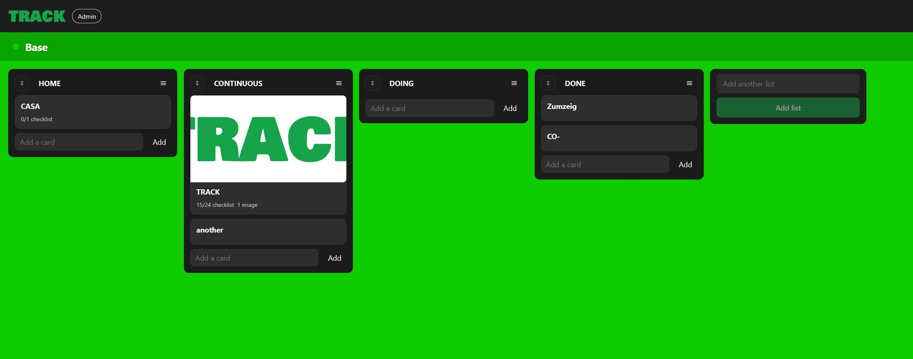

# Track
An open source self-hosted Trello-like kanban app with FastAPI backend and Vue frontend.

## Preview



## Configuration
Track is configured primarily through `backend/.env`.

1. Copy `backend/.env.example` to `backend/.env`
2. Edit values for your environment

Key runtime values:

- `TRACK_SERVER_HOST` (default `127.0.0.1`)
- `TRACK_SERVER_PORT` (default `8000`)
- `TRACK_SERVER_RELOAD` (development only)
- `TRACK_SERVER_WORKERS` (production)

Admin bootstrap and SMTP are also available in `.env`:

- `TRACK_ADMIN_BOOTSTRAP_EMAIL`
- `TRACK_ADMIN_BOOTSTRAP_PASSWORD`
- `TRACK_ADMIN_BOOTSTRAP_FULL_NAME`
- `TRACK_ADMIN_RESET_PASSWORD_ON_STARTUP`
- `TRACK_SMTP_*`
- `TRACK_EMAIL_FROM`

Optional legacy fallback:

- `backend/config/system.yaml` is still supported if present.
- `.env` is the recommended source for production.

## Local Run

### Backend

```bash
cd backend
pip install -e .
cp .env.example .env
# edit .env
python -m app.run
```

### Frontend

```bash
cd frontend
npm install
npm run dev
```

Frontend dev server proxies `/api/*` to `http://127.0.0.1:8000`.

Frontend env options (`frontend/.env` or shell env):

- `VITE_APP_BASE_PATH` (default `/`) for subpath deploys like `/track/`
- `VITE_API_BASE_URL` (default `/api`)
- `VITE_DEV_API_PROXY_TARGET` (default `http://127.0.0.1:8000`)

## Production Deploy (Ubuntu)

### 1) Install system packages

```bash
sudo apt update
sudo apt install -y python3 python3-venv python3-pip nginx curl

# install Node.js 20 LTS (recommended for this frontend)
curl -fsSL https://deb.nodesource.com/setup_20.x | sudo -E bash -
sudo apt install -y nodejs
```

### 2) Prepare project

```bash
# example location
sudo mkdir -p /opt/track
sudo chown -R $USER:$USER /opt/track
cd /opt/track

# clone/copy project here
```

### 3) Backend setup

```bash
cd /opt/track/backend
python3 -m venv .venv
source .venv/bin/activate
pip install --upgrade pip
pip install -e .
cp .env.example .env
# edit .env (set strong secret key, admin credentials, db path, smtp, host/port)
```

Recommended production values in `.env`:

- `TRACK_SECRET_KEY=<long-random-secret>`
- `TRACK_SERVER_HOST=127.0.0.1`
- `TRACK_SERVER_PORT=8000`
- `TRACK_SERVER_RELOAD=false`
- `TRACK_SERVER_WORKERS=2` (or more based on CPU)
- `TRACK_ALLOWED_ORIGINS=https://your-domain.com`
- `TRACK_API_PREFIX=/api` (default)

### 4) Frontend build

```bash
cd /opt/track/frontend
npm ci
npm run build
```

This creates static assets in `frontend/dist`.

#### Frontend API URL (custom server path)

If your API is served from a custom URL/path, set `VITE_API_BASE_URL` before building.
This value is baked into the frontend build output.
Make sure it matches backend `TRACK_API_PREFIX`.

Option A: one-off build variable

```bash
cd /opt/track/frontend
VITE_API_BASE_URL="https://your-domain.com/track/api" npm run build
```

Option B: local production env file (not committed)

Create `frontend/.env.production.local`:

```env
VITE_API_BASE_URL=https://your-domain.com/track/api
```

Then build normally:

```bash
cd /opt/track/frontend
npm run build
```

#### Frontend app base path (subpath deploy, e.g. `/track/`)

If frontend is served under a subpath, set:

```env
VITE_APP_BASE_PATH=/track/
```

This affects Vite asset URLs and Vue Router base history.

For local dev, keep:

```env
VITE_APP_BASE_PATH=/
```

### 5) Create systemd service for backend

Create `/etc/systemd/system/track-backend.service`:

```ini
[Unit]
Description=Track Backend API
After=network.target

[Service]
Type=simple
User=www-data
WorkingDirectory=/opt/track/backend
EnvironmentFile=/opt/track/backend/.env
ExecStart=/opt/track/backend/.venv/bin/python -m app.run
Restart=always
RestartSec=3

[Install]
WantedBy=multi-user.target
```

Enable and start:

```bash
sudo systemctl daemon-reload
sudo systemctl enable track-backend
sudo systemctl start track-backend
sudo systemctl status track-backend
```

View logs:

```bash
journalctl -u track-backend -f
```

### 6) Configure nginx

Create `/etc/nginx/sites-available/track`:

```nginx
server {
    listen 80;
    server_name your-domain.com;

    root /opt/track/frontend/dist;
    index index.html;

    location /api/ {
        proxy_pass http://127.0.0.1:8000;
        proxy_set_header Host $host;
        proxy_set_header X-Real-IP $remote_addr;
        proxy_set_header X-Forwarded-For $proxy_add_x_forwarded_for;
        proxy_set_header X-Forwarded-Proto $scheme;
    }

    location / {
        try_files $uri $uri/ /index.html;
    }
}
```

If you serve the frontend under a subpath like `/track/`, use this pattern instead:

```nginx
server {
    listen 80;
    server_name your-domain.com;

    # Backend API
    location /api/ {
        proxy_pass http://127.0.0.1:8000;
        proxy_set_header Host $host;
        proxy_set_header X-Real-IP $remote_addr;
        proxy_set_header X-Forwarded-For $proxy_add_x_forwarded_for;
        proxy_set_header X-Forwarded-Proto $scheme;
    }

    # Frontend served from /track/
    location /track/ {
        alias /opt/track/frontend/dist/;
        try_files $uri $uri/ /track/index.html;
    }
}
```

In this mode, set frontend build env:

```env
VITE_APP_BASE_PATH=/track/
VITE_API_BASE_URL=/api
```

Enable site and reload nginx:

```bash
sudo ln -s /etc/nginx/sites-available/track /etc/nginx/sites-enabled/track
sudo nginx -t
sudo systemctl reload nginx
```

### 7) TLS (recommended)

Use Certbot for HTTPS:

```bash
sudo apt install -y certbot python3-certbot-nginx
sudo certbot --nginx -d your-domain.com
```

## Notes

- Email delivery failures are logged and do not break user-facing actions.
- Uploaded files are stored locally under `backend/data/uploads/cards` by default.
- SQLite is fine for first production release and small teams; for growth, move to PostgreSQL.


### Common build error (Node version)

If you see:

```
SyntaxError: The requested module 'node:fs/promises' does not provide an export named 'constants'
```

You are running an old Node.js version. Upgrade Node and reinstall deps:

```bash
cd /opt/track/frontend
rm -rf node_modules package-lock.json
curl -fsSL https://deb.nodesource.com/setup_20.x | sudo -E bash -
sudo apt install -y nodejs
node -v
npm install
npm run build
```

Reference:
- Vite 6 Node support: https://vite.dev/blog/announcing-vite6
- Vite current getting started (Node requirement): https://vite.dev/guide/
